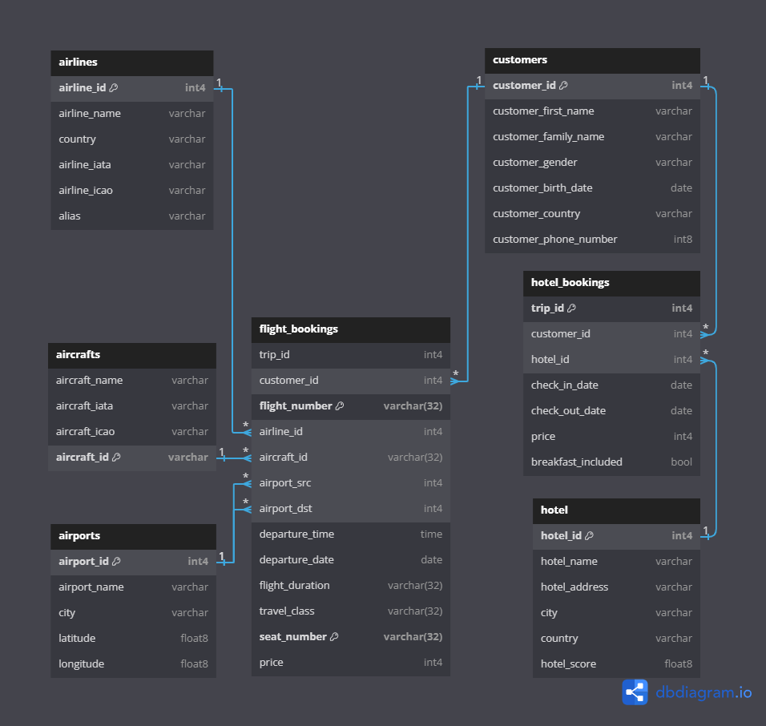
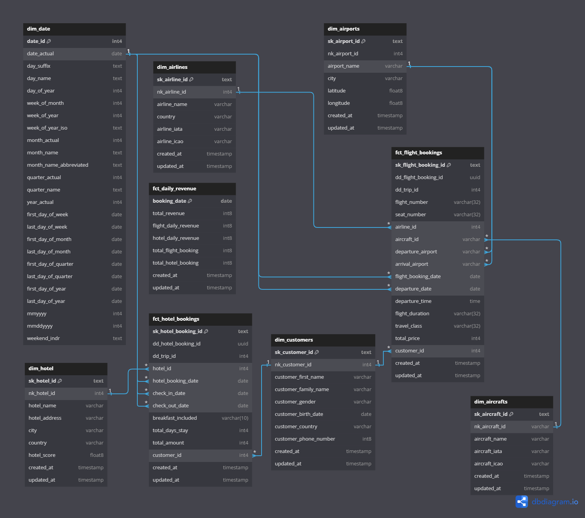
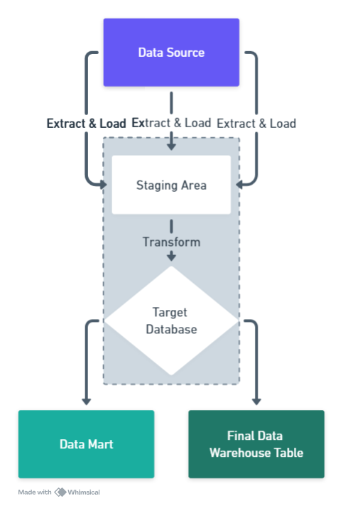
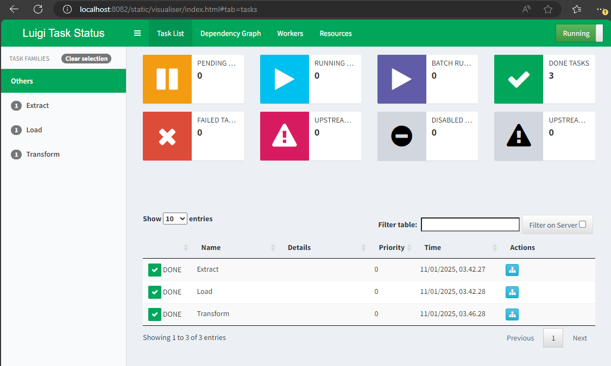
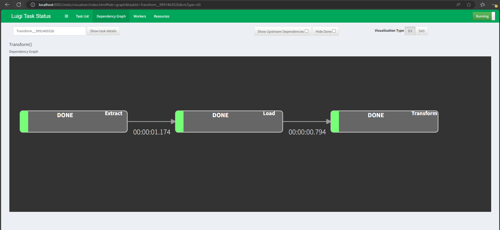
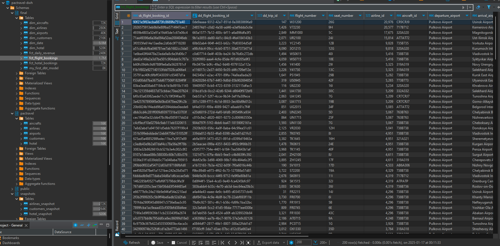
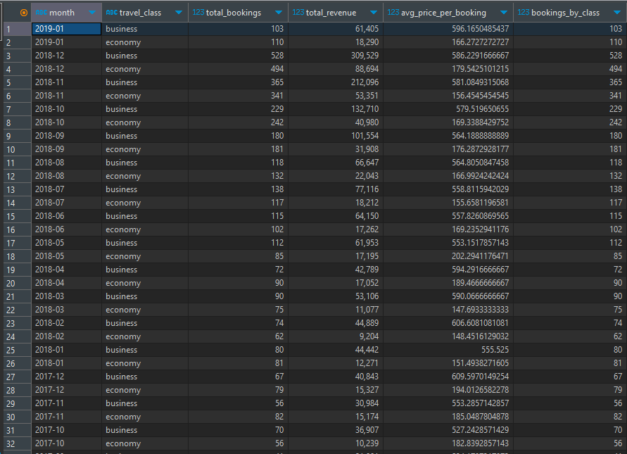
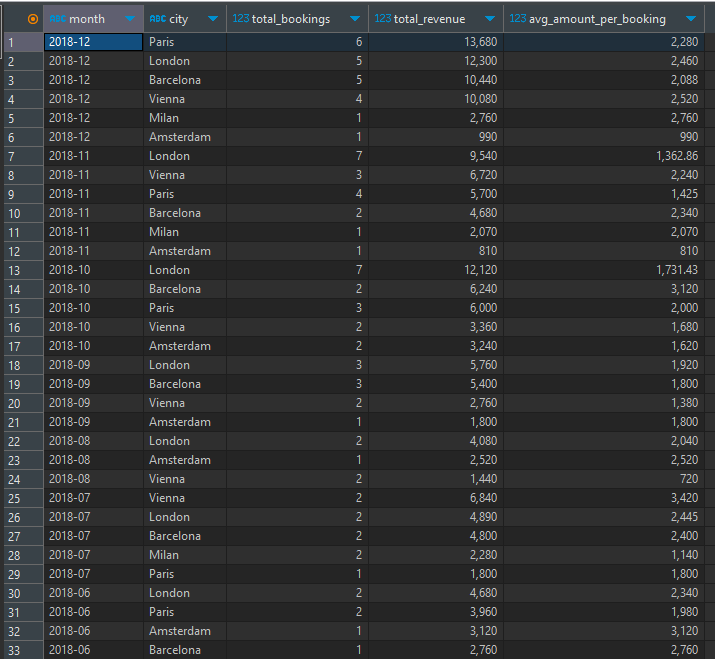
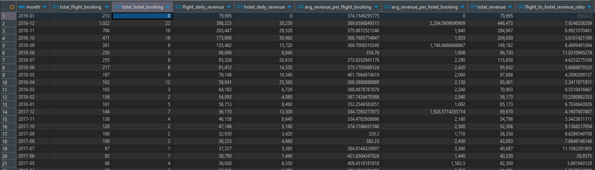

# ELT Pipeline Orhcestration - Pactravel Data Warehouse

## Overview
This project implements a Data Warehouse (DWH) for Pactravel, designed to enhance data analysis capabilities for better strategic decision-making. It utilizes Slowly Changing Dimensions (SCD) strategies and an ELT pipeline with DBT, Python, SQL, and Luigi for orchestration. The final output provides enriched insights into daily booking volumes and revenue trends.

## Table of Contents
1. [Overview](#overview)
2. [Requirements Gathering](#requirements-gathering)
3. [Slowly Changing Dimension (SCD)](#slowly-changing-dimension-scd)
   1. [Strategy](#strategy)
4. [ELT with Python & SQL](#elt-with-python--sql)
   1. [Workflow Description](#workflow-description)
   2. [Setup and Execution](#setup-and-execution)
   3. [Code Highlights](#code-highlights)
5. [Orchestrate ELT with Luigi](#orchestrate-elt-with-luigi)
   1. [Setup Instructions](#setup-instructions)
6. [Requirements](#requirements)
7. [Results](#results)
8. [References](#references)

## Requirements Gathering
### Key Questions and Answers

1. **What is the main goal of the data warehouse for this project?**  
   The goal is to create a central system where we can track daily bookings for flights and hotels, and monitor how ticket prices change over time.

2. **What factors are important for understanding daily booking numbers?**  
   Important factors include the date, customer details, airport and airline information, and hotel details.

3. **How detailed should the flight booking data be?**  
   We need to track each booking in detail, including the date, customer, price, and flight information.

4. **Do we need to track changes over time for certain types of data?**  
   Yes, we should track changes for data like customer information, hotels, and airlines, so we can keep a complete history of these changes.

5. **How often should we update the data warehouse?**  
   The data warehouse should be updated every day to ensure that our reports are accurate and up to date.

6. **How should we handle changes to historical data?**  
   We should store different versions of the data when it changes over time, so we can always see what the data looked like in the past.

### Summary
**Point Description:** The travel business currently operates transactionally, with data stored effectively in databases for booking flight and hotel reservations.  
**Problem:** There is no dedicated analytical database to leverage stored data for strategic planning to increase revenue.  
**Solution:**  
1. **Data Warehouse:** Implement a data warehouse to process stored data analytically, revealing patterns, trends, and potential strategies to enhance travel business revenue.
2. **SCD Type 2 Implementation:** Utilize DBT snapshots for SCD Type 2, preserving historical data for deeper analysis.
3. **ELT Pipeline:** Implement an ELT pipeline using Luigi and DBT, including error logging and alerting via Python and Sentry SDK.
4. **Scheduling:** Use cron for scheduling data updates to keep the data warehouse current.

## Slowly Changing Dimension (SCD)
### Strategy
| Dim Tables   | SCD Type | Explanation                                           |
|--------------|----------|-------------------------------------------------------|
| `dim_customers` | Type 2   | Tracks changes in customer details over time.         |
| `dim_hotels`    | Type 2   | Captures historical changes in hotel information.     |
| `dim_airlines`  | Type 2   | Maintains history of airline data changes.            |
| `dim_aircrafts` | Type 1   | Updates data without retaining historical changes.    |
| `dim_airports`  | Type 1   | Stores the most recent data without history.          |

## ERD Source


## ERD Final Plan


### Business Processes and Details

#### Business Process: Bookings / Order Transaction
- **Declare Grain:**
  - A single data point represents a flight booking order by a customer.
  - A single data point represents a hotel booking order by a customer.
- **Identify the Dimensions:**
  - `dim_customer`
  - `dim_airports`
  - `dim_aircrafts`
  - `dim_airlines`
  - `dim_date`
  - `dim_hotel`
- **Identify the Facts:**
  - `fct_flight_bookings`
  - `fct_hotel_bookings`

#### Business Process: Daily Bookings Volume
- **Declare Grain:**
  - A single data point represents daily total revenue for each product (flight and hotel).
- **Identify the Dimensions:**
  - `dim_date`
- **Identify the Fact:**
  - `fct_daily_revenue`


### Business Process and Performance Metric Table

| Business Process         | Performance Metric                          |
|--------------------------|---------------------------------------------|
| Bookings / Order Transaction | Number of bookings, the most hotel/airlines bookings, detail bookings               |
| Daily Bookings Volume    | Daily total revenue by product (flight, hotel), Trend of revenue, Average booking value comparison |


### Bus Matrix for Final Schema Plan

| Fact                    | dim_customer | dim_airports | dim_aircrafts | dim_airlines | dim_date | dim_hotel |
|-------------------------|--------------|--------------|---------------|--------------|----------|-----------|
| `fct_flight_bookings`   | ✓            | ✓            | ✓             | ✓            | ✓        |           |
| `fct_hotel_bookings`    | ✓            |              |               |              | ✓        | ✓         |
| `fct_daily_revenue`     |              |              |               |              | ✓        |           |


## ELT with Python & SQL



### Workflow Description
1. **Extraction:** Data is extracted from PostgreSQL databases using Python and Luigi.
2. **Loading:** Data is loaded into public and staging schemas in the data warehouse.
3. **Transformation:** DBT transforms the data into data marts and the final data warehouse.

### Setup and Execution

### 1. Requirements

- OS :
    - Linux
    - WSL (Windows Subsystem For Linux)
- Tools :
    - Dbeaver
    - Docker
    - Cron
    - DBT
- Programming Language :
    - Python
    - SQL
- Python Libray :
    - Luigi
    - Pandas
    - Sentry-SDK
- Platforms :
    - Sentry

### 2. Preparations
1. Clone the repository (using git lfs clone).
2. Create a `.env` file with the following variables:

```env
# Source
SRC_POSTGRES_DB=pactravel
SRC_POSTGRES_HOST=localhost
SRC_POSTGRES_USER=[YOUR USERNAME]
SRC_POSTGRES_PASSWORD=[YOUR PASSWORD]
SRC_POSTGRES_PORT=[YOUR PORT]

# SENTRY DSN
SENTRY_DSN=... # Fill with your Sentry DSN Project 

# DWH
# Adjust with your directory. make sure to write full path
# Remove comment after each value
DIR_ROOT_PROJECT=... # <project_dir>
DIR_TEMP_LOG=... # <project_dir>/pipeline/temp/log
DIR_TEMP_DATA=... # <project_dir>/pipeline/temp/data
DIR_EXTRACT_QUERY=... # <project_dir>/pipeline/src_query/extract
DIR_LOAD_QUERY=... # <project_dir>/pipeline/src_query/load
DIR_TRANSFORM_QUERY=... # <project_dir>/pipeline/src_query/transform
DIR_LOG=... # <project_dir>/logs/
```

- **Run Data Sources & Data Warehouses** :
  ```
  docker compose up -d
  ```

- **Dataset**
    - Source: Pactravel
    - DWH:
        - staging schema: pactravel
        - final schema: final

3. Ensure the `/helper/source/init.sql` script has the data preloaded.
4. Run `elt_main.py` to execute the pipeline.
5. Monitor logs in the `/logs/logs.log/` directory for any errors.

**Run this command on the background process:**
```bash
luigid --port 8082
```

**To run the pipeline directly from the terminal:**
```bash
python3 elt_main.py
```

**Alternatively, schedule the pipeline using cron to run every hour:**
```bash
0 * * * * <project_dir>/elt_run.sh
```

### Code Highlights
- Use of Python and Luigi for orchestration.
- DBT for data transformation and implementing SCD strategies.

## Orchestrate ELT with Luigi
### Setup Instructions
1. **Python & Luigi:** Install required Python packages and set up Luigi for orchestration.
2. **DBT Models:** Develop DBT models for transforming data into the desired schema.
3. **Cron Scheduling:** Schedule data updates using cron jobs for continuous data flow.

In thats project directory, **create and use virtual environment**.
Then Install dependencies with:
```bash
pip install -r requirements.txt
```

## Results







### Example Queries

### Booking Trends and Pricing Strategy Insights

To provide insights for the management, you can run the following queries to analyze booking trends and pricing strategies.

### Flight Booking Trends

```sql
SELECT
    TO_CHAR(flight_booking_date, 'YYYY-MM') AS month,  -- Extract year and month (e.g., '2025-01')
    travel_class,  -- Travel class for each group
    COUNT(sk_flight_booking_id) AS total_bookings,  -- Total bookings per month and class
    SUM(total_price) AS total_revenue,  -- Total revenue per month and class
    AVG(total_price) AS avg_price_per_booking,  -- Average price per booking per month and class
    COUNT(sk_flight_booking_id) AS bookings_by_class  -- Number of bookings per travel class
FROM
    "final".fct_flight_bookings
GROUP BY
    TO_CHAR(flight_booking_date, 'YYYY-MM'), travel_class  -- Group by month and travel class
ORDER BY
    month DESC, travel_class;  -- Sort by month and travel class
```

### Flight Booking Results:



The results from this query show that flight bookings generally increase each month and each year. The highest number of bookings occurs in December, while the lowest is in February. Detailed daily booking data indicates that bookings peak at the beginning and end of each month, with business class bookings consistently outperforming economy class bookings.

---

### Hotel Booking Trends by City

```sql
-- Average hotel booking price by city
SELECT
    TO_CHAR(fhb.hotel_booking_date, 'YYYY-MM') AS month,
    dh.city,
    COUNT(fhb.sk_hotel_booking_id) AS total_bookings,
    SUM(fhb.total_amount) AS total_revenue,
    ROUND(AVG(fhb.total_amount), 2) AS avg_amount_per_booking
FROM
    final.fct_hotel_bookings fhb
JOIN
    final.dim_hotel dh
ON
    fhb.hotel_id = dh.nk_hotel_id
GROUP BY
    TO_CHAR(fhb.hotel_booking_date, 'YYYY-MM'),
    dh.city
ORDER BY
    month DESC, total_revenue DESC;
```

### Hotel Booking Results:



This query helps management track how hotel bookings and revenue changes over time, both monthly and in more detailed daily trends across different cities. The highest total revenue on average is observed in Paris and London. This data is useful for optimizing pricing strategies, promotions, and marketing efforts based on city-level trends.

---

### Combined Flight and Hotel Revenue Analysis

```sql
SELECT
    TO_CHAR(booking_date, 'YYYY-MM') AS month,  -- Extract the year and month (e.g., '2025-01')
    SUM(total_flight_booking) AS total_flight_booking,
    SUM(total_hotel_booking) AS total_hotel_booking,
    SUM(flight_daily_revenue) AS flight_daily_revenue,
    SUM(hotel_daily_revenue) AS hotel_daily_revenue,
    -- Calculate the average revenue per flight booking for the month
    CASE 
        WHEN SUM(total_flight_booking) > 0 THEN SUM(flight_daily_revenue) / SUM(total_flight_booking)
        ELSE 0
    END AS avg_revenue_per_flight_booking,
    -- Calculate the average revenue per hotel booking for the month
    CASE 
        WHEN SUM(total_hotel_booking) > 0 THEN SUM(hotel_daily_revenue) / SUM(total_hotel_booking)
        ELSE 0
    END AS avg_revenue_per_hotel_booking,
    -- Total revenue (flight + hotel) for comparison
    SUM(total_revenue) AS total_revenue,
    -- Ratio of flight to hotel revenue
    CASE
        WHEN SUM(hotel_daily_revenue) > 0 THEN SUM(flight_daily_revenue) / SUM(hotel_daily_revenue)
        ELSE NULL
    END AS flight_to_hotel_revenue_ratio
FROM
    "final".fct_daily_revenue
GROUP BY
    TO_CHAR(booking_date, 'YYYY-MM')  -- Group by month
ORDER BY
    month DESC;  -- Sort by month in descending order
```

### Revenue Comparison:



The comparison between flight and hotel bookings shows how each segment performs in terms of **total bookings** and **average revenue per booking**. This helps management assess which segment is more profitable on average. The **flight-to-hotel revenue ratio** provides a clear picture of how dependent the business is on each segment, illustrating the distribution of revenue across flights and hotels.

Overall, the trend indicates that revenue is increasing, with flight bookings remaining more profitable than hotel bookings. By analyzing the **average hotel booking price by city**, management can use this information to boost hotel bookings and improve profitability. Additionally, the **daily and monthly booking trends** provide valuable insights for adjusting pricing strategies.

---


## References
1. [DBT Documentation](https://docs.getdbt.com/)
2. [Luigi Documentation](https://luigi.readthedocs.io/)
3. [Sentry SDK](https://docs.sentry.io/platforms/python/)